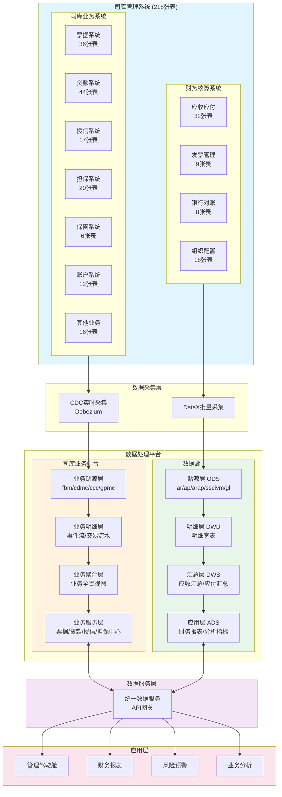
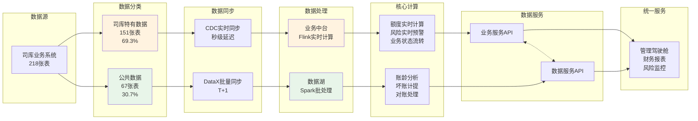
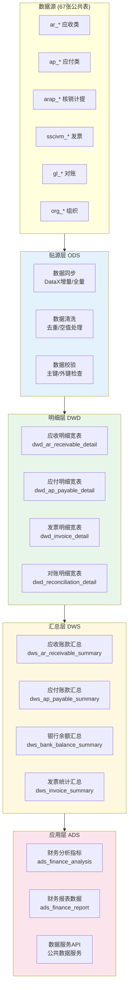
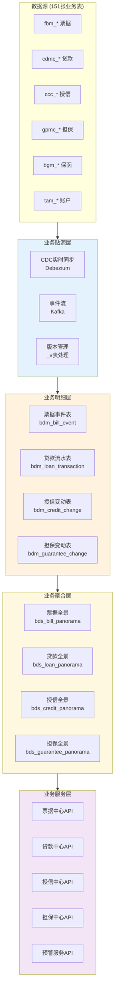
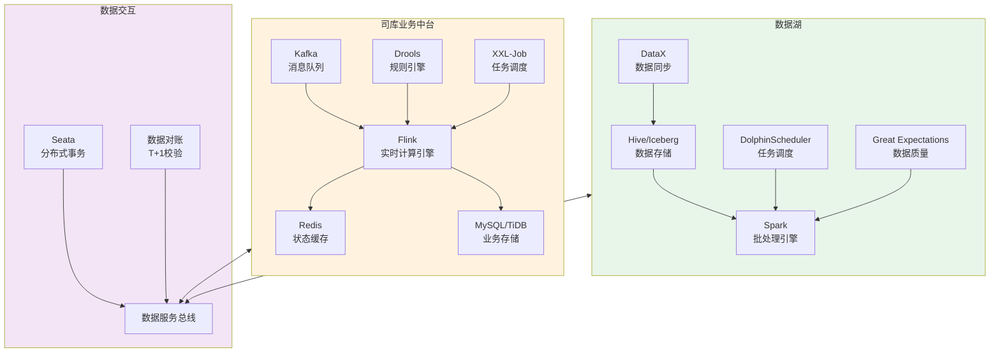
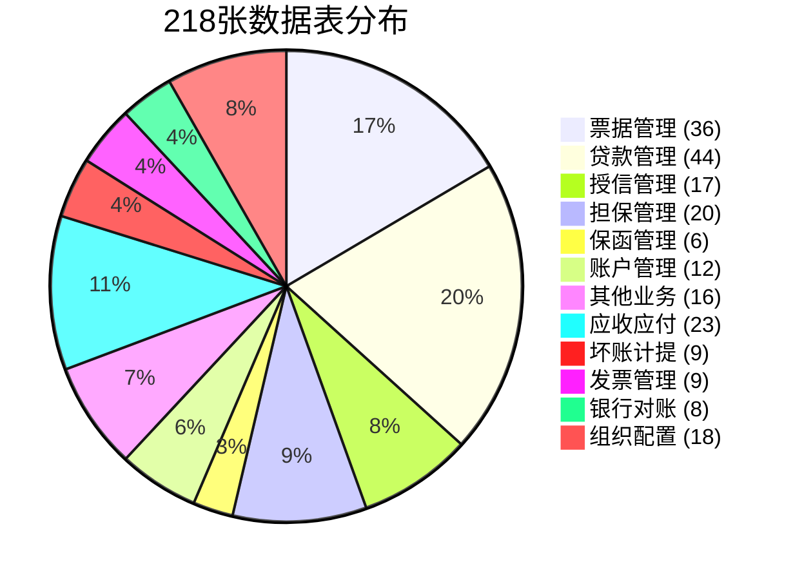
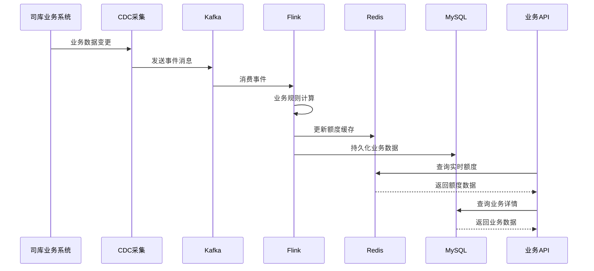
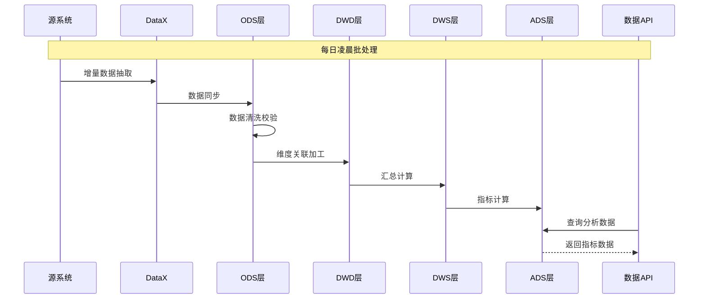
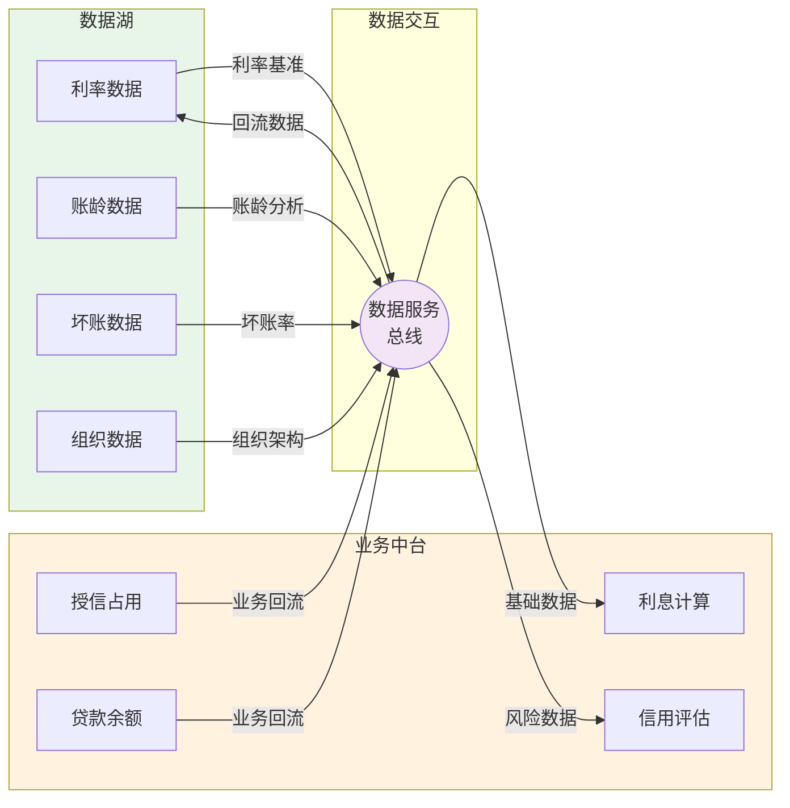

# 司库管理系统数据架构流程图

> 以下流程图使用 Mermaid 语法，可在飞书、语雀、Typora、VS Code 等支持 Mermaid 的工具中渲染查看

---

## 一、整体架构流程图

---

## 二、数据流转流程图

---

## 三、数据湖分层流程图

---

## 四、业务中台分层流程图

---

## 五、技术架构流程图

---

## 六、数据分类分布图

---

## 七、处理流程时序图

---

## 八、数据湖处理时序图

---

## 九、双平台协同流程图

---

## 十、实施路线流程图

```mermaid
flowchart LR
    subgraph P1["第一阶段"]
        A1[数据分类]
        A2[清单确认]
    end

    subgraph P2["第二阶段"]
        B1[数据湖ODS]
        B2[数据湖DWD]
        B3[数据湖DWS]
        B4[数据湖ADS]
    end

    subgraph P3["第三阶段"]
        C1[中台贴源层]
        C2[中台明细层]
        C3[中台聚合层]
        C4[中台服务层]
    end

    subgraph P4["第四阶段"]
        D1[服务对接]
        D2[一致性验证]
        D3[上线运行]
    end

    P1 --> P2
    P2 --> P3
    P3 --> P4

    style P1 fill:#e3f2fd
    style P2 fill:#e8f5e9
    style P3 fill:#fff3e0
    style P4 fill:#f3e5f5
```

---

## 使用说明

### 在线渲染
- 飞书文档：直接粘贴 Mermaid 代码块
- 语雀：直接粘贴 Mermaid 代码块
- GitHub：直接粘贴 Mermaid 代码块

### 本地渲染
- VS Code：安装 Markdown Preview Mermaid Support 插件
- Typora：原生支持 Mermaid
- Obsidian：原生支持 Mermaid

### 导出图片
- 使用 [Mermaid Live Editor](https://mermaid.live/) 在线编辑并导出 PNG/SVG
